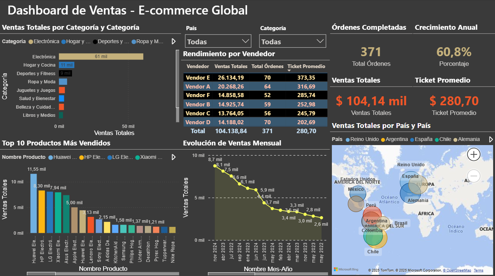

# 📊 Laboratorio de Análisis de Ventas — Power BI

  

Análisis de ventas de un e‑commerce internacional (2022–2024). Proyecto desarrollado con Microsoft Power BI Desktop: ETL, modelado dimensional, medidas DAX y dashboard interactivo.

---

## 📋 Tabla de contenido

- [📊 Laboratorio de Análisis de Ventas — Power BI](#-laboratorio-de-análisis-de-ventas--power-bi)
  - [📋 Tabla de contenido](#-tabla-de-contenido)
  - [⚡ Resumen rápido](#-resumen-rápido)
  - [Alcance](#alcance)
  - [Requisitos](#requisitos)
  - [Uso rápido — Abrir y explorar](#uso-rápido--abrir-y-explorar)
    - [Interacción](#interacción)
  - [🖼 Capturas (ejemplo)](#-capturas-ejemplo)
  - [Modelo de datos y medidas](#modelo-de-datos-y-medidas)
  - [ETL, modelado y visualización](#etl-modelado-y-visualización)
  - [✅ Cómo contribuir](#-cómo-contribuir)
    - [Medidas DAX (ejemplos)](#medidas-dax-ejemplos)
    - [Visuales incluidos](#visuales-incluidos)
  - [KPIs principales](#kpis-principales)
  - [Estructura de archivos](#estructura-de-archivos)
  - [Solución de problemas comunes](#solución-de-problemas-comunes)
  - [Estado y criterios de evaluación](#estado-y-criterios-de-evaluación)
  - [Contacto](#contacto)
  - [Documentación adicional](#documentación-adicional)
  - [Contribuciones](#contribuciones)
  - [Licencia](#licencia)

---

## ⚡ Resumen rápido

Abre `Dashboard_Final.pbix` con Power BI Desktop y explora los KPIs principales: Ventas Totales, Ticket Promedio, Crecimiento YoY y distribución por país y categoría. Usa los segmentadores para filtrar por año, país y categoría.

Pulsa "Actualizar" si modificas los archivos en `data/`.

## Alcance

- **Periodo:** Enero 2022 — Diciembre 2024
- **Volumen aproximado:** 100 productos, 250 clientes, 300–500 transacciones
- **Cobertura geográfica:** ~10 países (América, Europa)
- **Categorías de producto:** 10

## Requisitos

- Microsoft Power BI Desktop (versión gratuita). Descarga: https://powerbi.microsoft.com/desktop/
- Windows 10 o superior (recomendado)
- 4–8 GB RAM mínimo / 1 GB de espacio libre

Datos: coloca los archivos Excel en la carpeta `data/` con la estructura original para que Power BI encuentre las fuentes (o actualiza las rutas en el proyecto `.pbix`).

🚀 Instrucciones de Uso

## Uso rápido — Abrir y explorar

1. Abre Power BI Desktop.
2. Abre `Dashboard_Final.pbix` (doble clic o Archivo → Abrir).
3. Si Power BI solicita permisos para conexión, acepta para cargar datos locales.

Actualizar datos: Inicio → Actualizar. Si hay errores por rutas, ve a Transformar datos → Configuración de origen y corrige las rutas locales.

### Interacción

- Usa los segmentadores (Año, Categoría, País) para filtrar el dashboard.
- Haz clic en cualquier visual para aplicar filtrado cruzado.
- Pasa el cursor sobre elementos para ver tooltips con detalles.

---

## 🖼 Capturas (ejemplo)

Si quieres, puedes añadir capturas o GIFs del dashboard para mejorar la presentación. A modo de ejemplo, si colocas una imagen en `data/screenshot.png`, la puedes mostrar así:

## Modelo de datos y medidas

En la vista Modelo se implementa un esquema en estrella con las relaciones principales entre la tabla de hechos `Ventas` y las dimensiones (`Productos`, `Clientes`, `Calendario`, `Objetivos`).

Revisa las medidas DAX desde el panel Campos → tabla `Medidas` para entender las definiciones (Ventas Totales, Ticket Promedio, YoY, etc.).

🛠️ Componentes Técnicos Implementados
## ETL, modelado y visualización

ETL y Power Query:

- Conexión a archivos Excel (datos de productos, clientes y ventas).
- Limpieza, normalización y validación de tipos.
- Eliminación de duplicados y registros inválidos.

Modelado:

- Esquema estrella con tabla de hechos `Ventas` y dimensiones.
- Tabla Calendario creada y marcada como tabla de fechas.

Visualización:

- Dashboard con KPIs, mapas, series temporales, ranking por productos y segmentadores interactivos.

---

## ✅ Cómo contribuir

Contribuir es bienvenido — algunas ideas de trabajo:

- Mejorar o añadir visualizaciones en `Dashboard_Final.pbix`.
- Añadir datasets reales o ampliaciones en la carpeta `data/`.
- Documentar medidas DAX o añadir ejemplos de tests/validaciones de datos.

Buenas prácticas:

- Crea una rama con nombre descriptivo: `feature/tu-cambio` o `fix/descripcion`.
- Incluye un resumen breve del cambio en el PR y captura(s) si aplica.
- Mantén la estructura de `data/` o documenta cambios de rutas en el README.

🗃️ Modelado de Datos
✅ Esquema Estrella implementado

✅ Tabla de Hechos: Ventas

✅ Tablas de Dimensión: Productos, Clientes, Calendario, Objetivos

✅ 4 relaciones con cardinalidad correcta (*:1)

✅ Tabla Calendario creada con DAX y marcada como tabla de fechas

### Medidas DAX (ejemplos)
- Ventas Totales
- Total Órdenes
- Ticket Promedio
- Ventas Año Anterior (Time Intelligence)
- Porcentaje

### Visuales incluidos

- KPIs en el encabezado (Ventas Totales, Ticket, Clientes, Crecimiento YoY)
- Mapa por país
- Serie temporal (línea)
- Barras por categoría y Top 10 productos
- Tabla de desempeño por vendedor
- Segmentadores sincronizados

🔗 Interactividad
✅ Filtrado cruzado entre todos los visuales

✅ Segmentadores sincronizados

✅ Tooltips informativos

✅ Formato profesional aplicado

## KPIs principales

- Ventas Totales (periodo seleccionado)
- Órdenes completadas
- Ticket promedio
- Crecimiento anual (YoY %)

🔍 Análisis Disponibles
Evolución temporal de ventas (mensual)

Distribución geográfica por país

Rendimiento por categoría de producto

Top 10 productos más vendidos

Performance por vendedor

Distribución de métodos de pago

## Estructura de archivos

Laboratorio_PowerBI/

- `Dashboard_Final.pbix` — archivo principal de Power BI (modelo + visualizaciones).
- `Documentacion_ETL_Modelo.pdf` — documentación técnica de ETL y modelo.
- `data/` — carpeta con archivos fuente:
    - `Productos.xlsx` — catálogo de ~100 productos.
    - `Clientes.xlsx` — ~250 registros de clientes.
    - `Ventas.xlsx` — transacciones (2022–2024, ~300–500 filas en este dataset de ejemplo).

Relaciones principales:

- `Ventas[Código Producto] → Productos[Código Producto]` (*:1)
- `Ventas[ID Cliente] → Clientes[ID Cliente]` (*:1)
- `Ventas[Fecha] → Calendario[Date]` (*:1)
- `Calendario[Año] → Objetivos[Año]` (*:1)

📦 Tamaño del Archivo
Dashboard_Final.pbix: ~5-10 MB (aproximado)

## Solución de problemas comunes

- "No se puede cargar el archivo": verifica que Power BI Desktop esté instalado y actualizado.
- "Error al conectar a archivos Excel": Transformar datos → Configuración de origen → actualizar rutas.
- "Los visuales no muestran datos": haz clic en Actualizar y comprueba la ubicación de los archivos.
- "Time Intelligence no funciona": marca la tabla `Calendario` como tabla de fechas en la vista Modelo.
- "Dashboard lento": cierra otras aplicaciones o reduce el volumen de datos de ejemplo.
## Estado y criterios de evaluación

Este proyecto cumple los criterios de evaluación del laboratorio: modelado en estrella, transformaciones ETL documentadas, medidas DAX y un dashboard interactivo con visuales y segmentadores.

## Contacto

**Autor:** Tomadín Nicolás Adrián — nicolas.tomadin1995@gmail.com

## Documentación adicional

Consulta `Documentacion_ETL_Modelo.pdf` para detalles técnicos del proceso ETL y del diseño del modelo.

---

Si quieres, en el siguiente paso puedo añadir un archivo `LICENSE` (por ejemplo MIT) y un `README_short.md` más visual para la pantalla del repo. ¿Qué prefieres? (si quieres licencia, dime cuál: MIT/Apache-2.0/GPL-3.0/u otra)

---

Si quieres, puedo:

- Añadir una sección de instrucciones para extraer/transformar datos fuera de Power BI.
- Generar un pequeño script de ejemplo para convertir los datos fuente en CSV.
- Crear un checklist de evaluación o pruebas unitarias (donde aplique).

Si prefieres que mantenga una versión en inglés o que agregue imágenes y capturas del dashboard, dime y lo preparo.

💡 Notas Finales
Este proyecto cumple y excede todos los requisitos establecidos en la consigna del laboratorio. Se implementaron las mejores prácticas de modelado dimensional, transformación de datos y visualización para crear un dashboard profesional utilizable para análisis de negocio real.

El modelo está optimizado para rendimiento y escalabilidad, permitiendo agregar más datos históricos o nuevas dimensiones de análisis sin modificar la estructura base.

Todas las medidas DAX están documentadas y organizadas en una tabla específica para facilitar su mantenimiento y reutilización.

## Contribuciones

Si quieres colaborar en este laboratorio (añadiendo datasets, mejoras en el modelo o nuevas visualizaciones), abre un issue o envía un pull request describiendo tu propuesta.

Buenas prácticas para contribuir:

- Usa ramas con nombres descriptivos (feature/xxx, fix/yyy).
- Incluye una descripción clara del cambio y, si aplica, evidencia visual (capturas o gifs).
- Mantén compatibilidad con la estructura `data/` o documenta cualquier cambio de ruta.

## Licencia

Este repositorio no incluye una licencia explícita en este momento. Si quieres que el proyecto sea reutilizable por otros, te recomiendo añadir una licencia (por ejemplo MIT, Apache-2.0). Dime cuál prefieres y la agrego.
